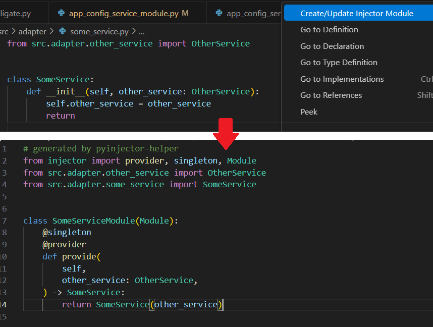

# Python Injector Helper

## 概要

この拡張機能は、Python のDIフレームワークである[Injector](https://github.com/python-injector/injector)を用いた開発をサポートするものです。

## Injector の実装方式と本拡張の価値

Python Injector には、大きく分けて 2 つの依存性注入（DI）実装方式があります。

|実装方式|メリット|デメリット|
| --- | --- | --- |
| **`@inject` を使用** |クラスや関数に直接 `@inject` デコレータを付与し、依存を解決|実装が簡単|大規模化すると依存の把握・管理が困難|
| **Module クラスを継承し `@singleton` / `@provider` を使用** |`Module` を継承したクラスで依存定義を一元管理|依存定義の集中管理が可能。テストや依存切り替えが容易|実装や修正のたびに `Module` を頻繁に更新する必要があり、手間がかかる|

本拡張機能は、この `Module` ベースの実装方式のメリットを最大限活かしつつ、更新作業の手間を大幅に削減 します。 
ソースコードから自動的に `@singleton`・`@provider` を持つ `Module` を生成・更新し、`Injector` 初期化コードも同時に反映します。 
これにより、煩雑な手動編集なしで常に最新の依存定義を維持できます。

## 機能

DI対象にしたいソースコード上で
- 右クリック→`Create/Update Injector Module`

で`Injector`初期化に使用する、 
`Module(Injector)`を継承し`@singleton`、`@provider`を付加したソースコードの生成、更新を行い、 
`Injector`初期化コードも更新できます。 
出力ディレクトリは`settings.json`で設定できます。

## 設定項目（Configuration）
`pyInjectorHelper`以下に、表の項目を設定してください。

|項目|デフォルト値|説明|
| --- | --- | --- |
|`moduleDir`|`src/di/modules`|`Injector`初期化用ソースコードを出力するディレクトリです。プロジェクトに合わせて設定してください。|
|`fileName.remove`|`["^interface_", "_interface$"]`|出力されるファイル名について、元ファイル名から除外したいパターンを指定できます。例えばインターフェース定義に`_interface`などの接尾語を用いていて、それを除外したい場合などに指定してください。|
|`fileName.addPrefix`|`""`|出力されるファイル名について、元ファイル名に付加したい接頭語があれば指定してください。|
|`fileName.addSuffix`|`_module`|出力されるファイル名について、元ファイル名に付加したい接尾語があれば指定してください。デフォルトでは`_module`が指定されています。|
|`className.deriveFromFileName`|`true`|出力されるソースコードについて、クラス名をファイル名と結びつける場合は`true`を指定してください。`true`を指定した場合、クラス名はファイル名に対するパスカルケースで生成され、以降の項目は省略できます。|
|`className.remove`|`["^Interface", "^interface_", "_interface$", "Interface$"]`|出力されるクラス名について、元クラス名から除外したいパターンを指定できます。|
|`className.addPrefix`|`""`|出力されるクラス名について、元クラス名に付加したい接頭語があれば指定してください。|
|`className.addSuffix`|`"Module"`|出力されるクラス名について、元クラス名に付加したい接尾語があれば指定してください。デフォルトでは`Module`が指定されています。|

設定例

<pre><code>
{
  // =====================================================
  // Python Injector Helper 設定 (Japanese)
  // =====================================================
  "pyInjectorHelper": {
    // モジュールファイル出力ディレクトリのパス
    // 例: "src/di/modules"
    "moduleDir": "src/di/modules",
    "fileName": {
      // モジュール名生成前にファイル名から削除する接頭語・接尾語
      // 例: "_interface$"  service_interface.py → service.py
      "remove": ["^interface_", "_interface$"],
      // モジュール名生成時にファイル名へ追加する接頭語
      // 例: "module_"  service.py → module_service.py
      "addPrefix": "",
      // モジュール名生成時にファイル名へ追加する接尾語
      // 例: "_module"  service.py → service_module.py
      "addSuffix": "_module"
    },
    "className": {
      // true の場合、クラス名は接頭語・接尾語処理後のファイル名から生成
      // false の場合、ファイル名とクラス名は独立して処理
      "deriveFromFileName": true,
      // モジュール名生成前にクラス名から削除する接頭語・接尾語
      // 例: "Interface$"  ServiceInterface → Service
      "remove": ["^Interface", "^interface_", "_interface$", "Interface$"],
      // モジュール名生成時にクラス名へ追加する接頭語
      // 例: "Module"  Service → ModuleService
      "addPrefix": "",
      // モジュール名生成時にクラス名へ追加する接尾語
      // 例: "Module"  Service → ServiceModule
      "addSuffix": "Module"
    }
  }
}
</pre></code>

## 依存関係

Python 3.8 以降推奨。`ast` は標準ライブラリ、`injector` は別途インストールが必要です。

Icon made by [Flatart](https://www.iconfinder.com/Flatart) from [Iconfinder](https://www.iconfinder.com/search?q=python)