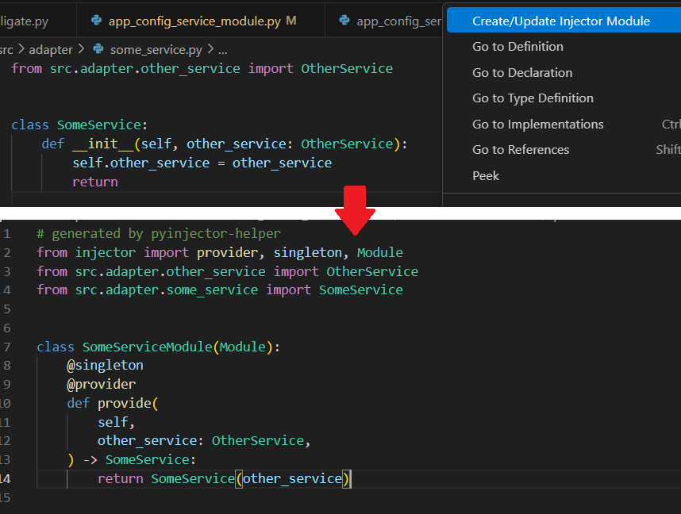

# Python Injector Helper

[日本語](README.jp.md)

## Overview

This extension supports development using [Injector](https://github.com/python-injector/injector), a dependency injection (DI) framework for Python.

## Injector Implementation Methods and the Value of This Extension

Python Injector has two major DI implementation approaches:

| Implementation Method | Advantages | Disadvantages |
| --- | --- | --- |
| **Using `@inject`** | Attach the `@inject` decorator directly to classes or functions to resolve dependencies | Simple to implement | In large-scale projects, it becomes difficult to track and manage dependencies |
| **Extending the `Module` class and using `@singleton` / `@provider`** | Manage all dependency definitions centrally within a class that extends `Module` | Centralized dependency management; easy to switch dependencies and perform testing | Requires frequent updates to `Module` whenever implementation or modifications occur, which can be tedious |

This extension maximizes the benefits of the `Module`-based approach while **significantly reducing the manual workload**. 
It automatically generates and updates `Module` classes containing `@singleton` and `@provider` from source code, and updates the `Injector` initialization code at the same time. 
This ensures your dependency definitions are always up to date without tedious manual edits.

## Features

On any source code that should be DI-managed:
- Right-click → `Create/Update Injector Module`

This will:
- Generate or update source code that extends `Module(Injector)` and contains `@singleton` and `@provider`
- Update the `Injector` initialization code

The output directory can be configured in `settings.json`.

## Configuration
Under `pyInjectorHelper`, configure the following items:

| Key | Default Value | Description |
| --- | --- | --- |
| `moduleDir` | `src/di/modules` | The directory where the `Injector` initialization source code will be output. Adjust to match your project structure. |
| `fileName.remove` | `["^interface_", "_interface$"]` | Patterns to remove from the original file name for output files. Useful when you have suffixes like `_interface` for interface definitions that you want excluded. |
| `fileName.addPrefix` | `""` | Prefix to add to the original file name for output files. |
| `fileName.addSuffix` | `_module` | Suffix to add to the original file name for output files. Defaults to `_module`. |
| `className.deriveFromFileName` | `true` | If `true`, class names in generated source code will be derived from the file name in PascalCase, and the following className rules can be omitted. |
| `className.remove` | `["^Interface", "^interface_", "_interface$", "Interface$"]` | Patterns to remove from the original class name for output classes. |
| `className.addPrefix` | `""` | Prefix to add to the original class name for output classes. |
| `className.addSuffix` | `"Module"` | Suffix to add to the original class name for output classes. Defaults to `Module`. |

Configuration Example

<pre><code>
{
  // =====================================================
  // Python Injector Helper Settings
  // =====================================================
  "pyInjectorHelper": {
    // Path for outputting module files
    // Example: "src/di/modules"
    "moduleDir": "src/di/modules",
    "fileName": {
      // Remove these patterns from file names before generating module names
      // Example: "_interface$"  service_interface.py → service.py
      "remove": ["^interface_", "_interface$"],
      // Add this prefix to file names when generating module names
      // Example: "module_"  service.py → module_service.py
      "addPrefix": "",
      // Add this suffix to file names when generating module names
      // Example: "_module"  service.py → service_module.py
      "addSuffix": "_module"
    },
    "className": {
      // If true, class names will be generated from processed file names
      // If false, file names and class names are handled independently
      "deriveFromFileName": true,
      // Remove these patterns from class names before generating module names
      // Example: "Interface$"  ServiceInterface → Service
      "remove": ["^Interface", "^interface_", "_interface$", "Interface$"],
      // Add this prefix to class names when generating module names
      // Example: "Module"  Service → ModuleService
      "addPrefix": "",
      // Add this suffix to class names when generating module names
      // Example: "Module"  Service → ServiceModule
      "addSuffix": "Module"
    }
  }
}
</code></pre>

## Dependencies

Python 3.8 or later is recommended.  
`ast` is part of the standard library.  
`injector` must be installed separately.

Icon made by [Flatart](https://www.iconfinder.com/Flatart) from [Iconfinder](https://www.iconfinder.com/search?q=python)